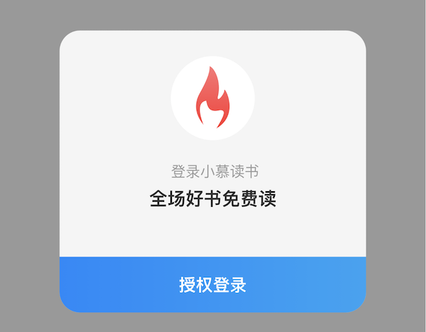

# 用户授权

## 用户授权流程


### 用户授权判断
通过`mpvue.getSetting`判断小程序是否获得权限

::: tip
查看[官方文档](https://developers.weixin.qq.com/miniprogram/dev/api/open-api/setting/wx.getSetting.html)
:::

### 用户申请授权
如果小程序未获得授权，我们需要提供用户主动申请授权的功能，微信规定获取用户信息，必须用户主动触发，此时我们需要借助`button`组件完成用户授权事件绑定，关键步骤：
```html
<button
  @getuserinfo="getUserInfo"
  open-type="getUserInfo"
>
  授权登录
</button>
```
关于`getuserinfo`和`open-type`的官方说明如下：

| 属性 | 说明 |
| --- | --- |
| open-type	| 微信开放能力	 |
| bindgetuserinfo | 用户点击该按钮时，会返回获取到的用户信息，回调的detail数据与wx.getUserInfo返回的一致，open-type="getUserInfo"时有效 |

::: tip
查看[官方文档](https://developers.weixin.qq.com/miniprogram/dev/framework/open-ability/authorize.html)
:::

### 获取用户信息
通过`mpvue.getUserInfo`获取用户信息

::: tip
查看[官方文档](https://developers.weixin.qq.com/miniprogram/dev/api/open-api/user-info/wx.getUserInfo.html)
:::

### 获取openId
由于每个用户在每个小程序都会获得唯一的`openId`，所以`openId`非常适合用作用户的唯一标识，获取`openId`我们需要通过官方提供的`api` `auth.code2Session
`来获取，为了简化`api`调用，课程提供了该`api`的封装版本，[立即查看](https://www.youbaobao.xyz/mpvue-docs/api/#%E8%8E%B7%E5%8F%96%E5%BE%AE%E4%BF%A1%E7%94%A8%E6%88%B7%E7%9A%84openid)

::: tip
查看[官方文档](https://developers.weixin.qq.com/miniprogram/dev/api-backend/open-api/login/auth.code2Session.html)
:::

### 用户注册
获得`openId`后，我们可以通过该`openId`和用户信息在小慕读书中进行注册，课程提供了注册的`api`，[立即查看](https://www.youbaobao.xyz/mpvue-docs/api/#%E7%94%A8%E6%88%B7%E6%B3%A8%E5%86%8C)

## 授权组件
用户授权登录组件


<table>
    <tr>
        <th>组件名称</th>
        <th>属性</th>
        <th>参数</th>
        <th>用途</th>
        <th>默认值</th>
    </tr>
    <tr>
        <td rowspan="11">Auth</td>
        <td>method</td>
        <td>getUserInfo</td>
        <td>获取用户信息</td>
        <td>(空)</td>
    </tr>
</table>

::: tip
LOGO图片地址：[https://www.youbaobao.xyz/mpvue-res/logo.jpg](https://www.youbaobao.xyz/mpvue-res/logo.jpg)
:::
